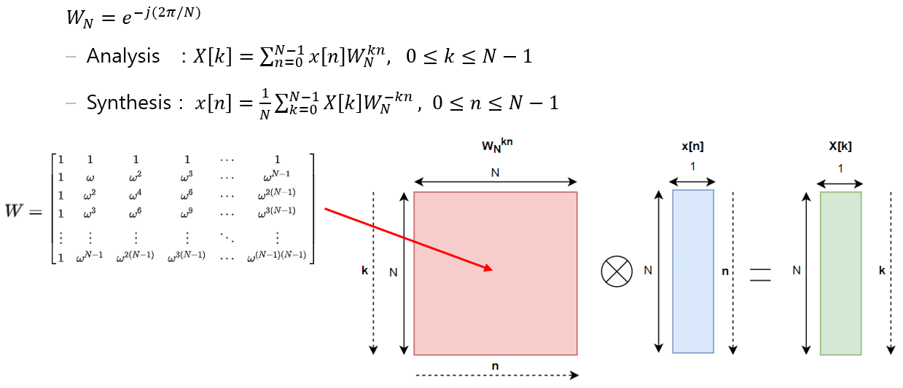
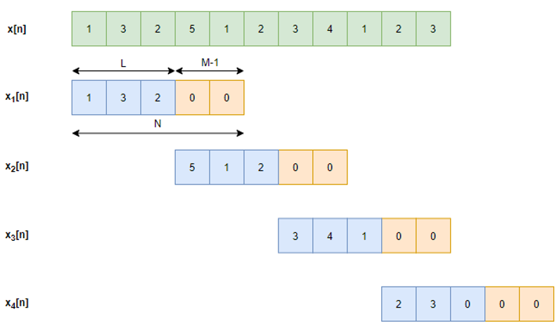
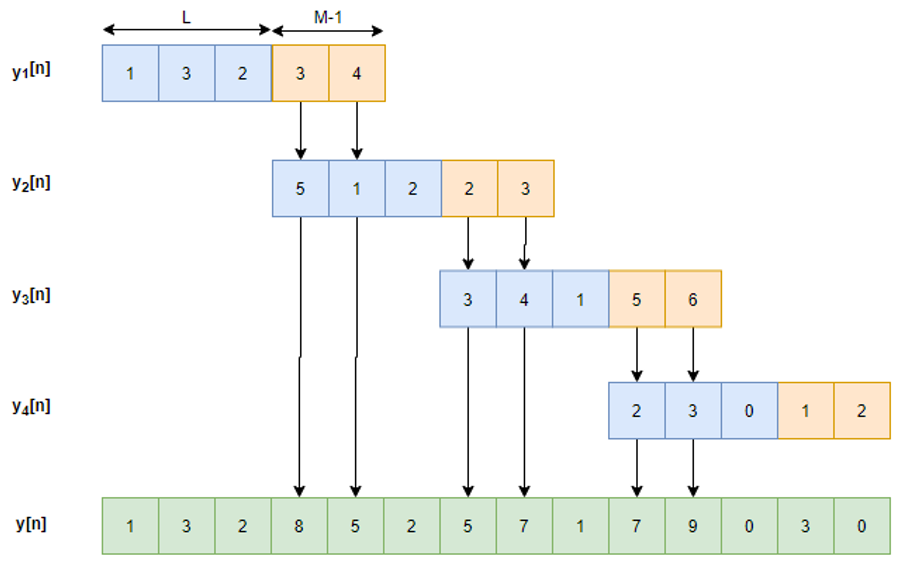
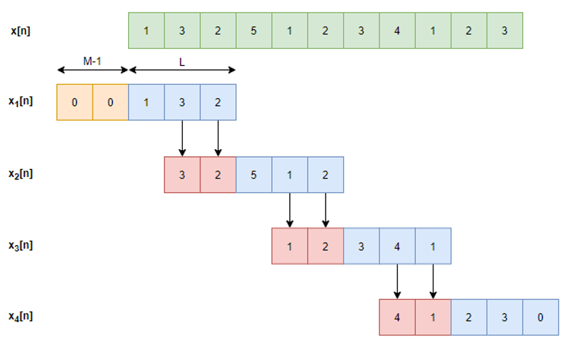
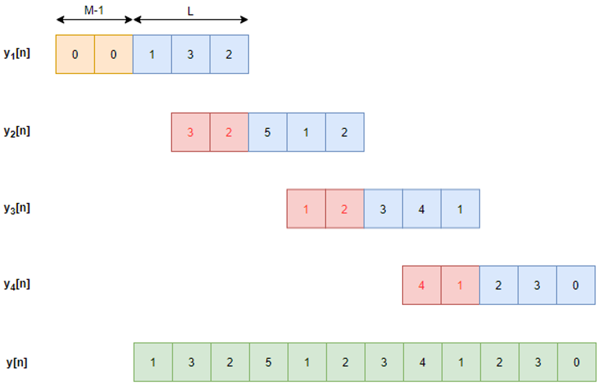

# Implementation DFT and overlap Method(overlapadd & overlap-save)

- This project just deals with **DFT** and **Block Convoltuion** using **Two Overlap Methods** in DSP 
- Implement using **C++11**
- FFT uses the [**kiss_fft**](https://github.com/mborgerding/kissfft) library
- Use Low-pass Filter 
- it was tested on the **Window 10**, **Visual Studio 15**


# Project Guide


## How to use

### Simple Test

1. Download Project

```bash
git clone https://github.com/fbdp1202/DSP_Overlap-Save_Overlap_Add.git
```


2. Open Visual Studio Project **"DSP_Overlap-Save_Overlap_Add.sln"**

   

3. Just Build and Run

### Optional mode

```C++
// main.cpp
std::string fileName = "sa1.wav";

const int N = 1024;
const int M = 512;

Block_conv* tests[4];
std::string strOverlapAdd = "overlap_add";
std::string strOverlapSave = "overlap_save";
std::string strFFT = "fft";
std::string stdDFT = "dft";

tests[0] = new Block_conv(fileName, strOverlapAdd, strFFT, N, M);
tests[1] = new Block_conv(fileName, strOverlapAdd, stdDFT, N, M);
tests[2] = new Block_conv(fileName, strOverlapSave, strFFT, N, M);
tests[3] = new Block_conv(fileName, strOverlapSave, stdDFT, N, M);
```

- **fileName** : Choose Wav File (only **Single Channel** and **16bit Sample Length**)

- **N** : number of DFT 

- **M** : length of Low-Filter

- **Func@Block_conv( 	std::string		input wav file Name**,

  ​										**std::string		method   //  Choose method "overlap_add"  or  "overlap_save"**

  ​										**std::string	)	mode    //  Choose mode "fft"  or  "dft"**


## Overall System Block Diagram
#### 1. Read wav file header
#### 2. Store wav data in x[n] (block size)
#### 3. DTFT of h(n) and x[n]
#### 4. Multiply Y(z)=𝐻(𝑧)×𝑋(𝑧)
#### 5. IDTFT of 𝑌(𝑧)
#### 6. Do overlap-save or overlap-add
#### 7. Repeat 2~6 until all wav data is read
#### 8. Save wav


## Implementation of DFT




## Overlap Add
### Input



---

### Output



---


## Overlap Save

### Input


### Output


---


# LICENSE

[BSD-3-Clause](LICENSES/BSD-3-Clause)
[MIT](LICENSES/LICENSE.md)
[Unlicense](LICENSES/Unlicense)

# Reference

[Wav header format](https://m.blog.naver.com/PostView.nhn?blogId=psychoria&logNo=40139175382&proxyReferer=https:%2F%2Fwww.google.com%2F)

[How to read Wav file](https://stackoverrun.com/ko/q/3685205)

[kiss fft](https://github.com/mborgerding/kissfft)

[overlap-save concept](https://www.youtube.com/watch?v=AsVX2CxviWI&t=257s)

[overlap-add concept](https://www.youtube.com/watch?v=FPzZj30hPY4&t=182s)

[DFT Matrix](https://en.wikipedia.org/wiki/DFT_matrix)